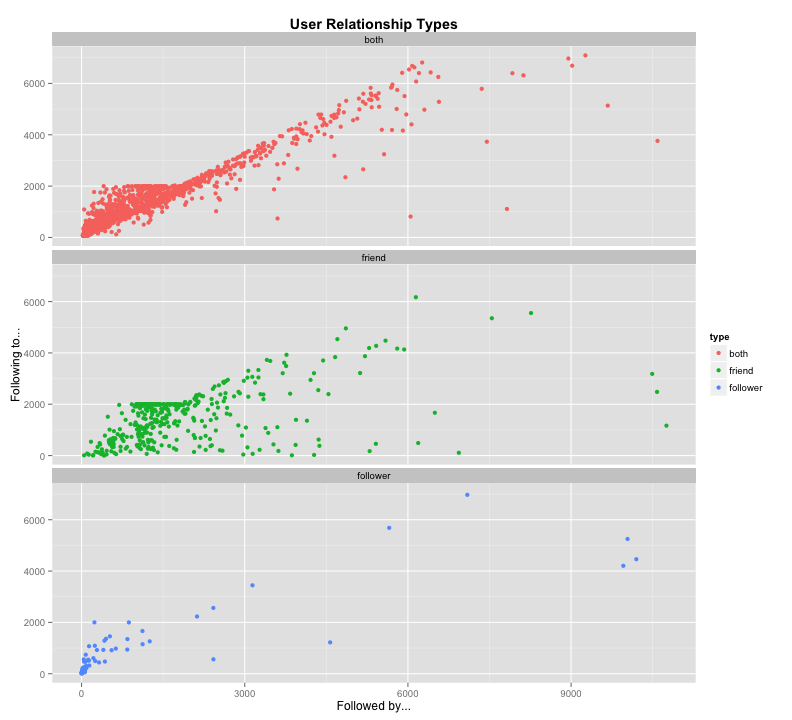
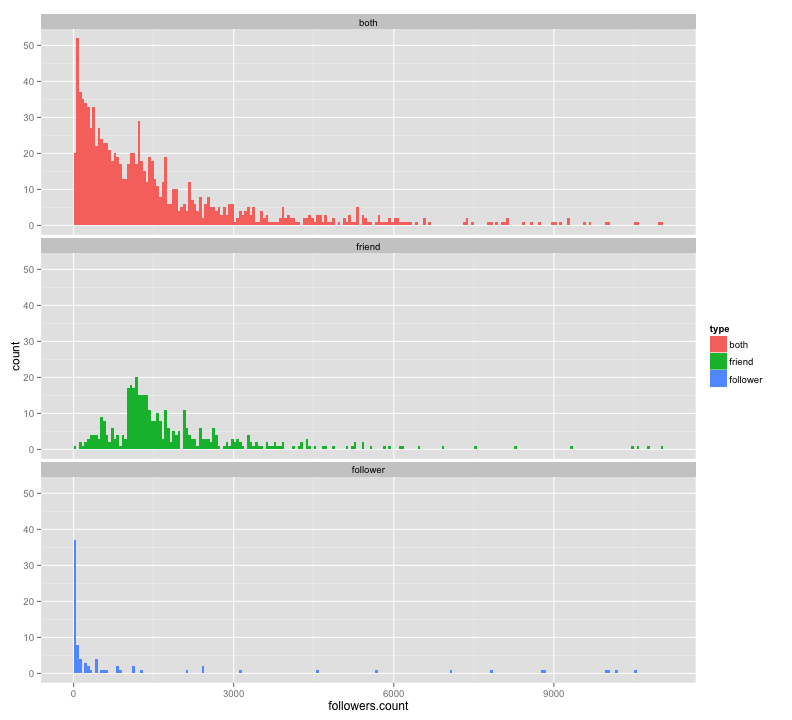

Twitter
========================================================

I can't follow more than 2000 people. I need follow people who follow back. And I need people with many followers. So, if the retweet, my tweets will spread faster.

I'm going to explore some data.

## Configuring the analysis
Create your own twitter application on https://dev.twitter.com and complete with your data the parameters: 

```r
app.name <- "xxxxx"
key <- "xxxxx"
secret <- "xxxxx"

token <- "xxxxx"
token.secret <- "xxxxx"

# Account to analyse
twitter.user <- "xxxxxxxxx"
```


```r
library(httr)
library(plyr)
library(ggplot2) 
library(xtable)

# Do not use scientific notation
options(scipen=999)
```


```r
# Accessing Twitter from R
myapp <- oauth_app(app.name, key=key, secret=secret)
sign.oauth <- sign_oauth1.0(myapp, token = token, token_secret = token.secret)
```

## Getting data from twitter

Get number of followers and friends.

```r
request <- paste0("https://api.twitter.com/1.1/users/show.json?screen_name=", 
                  twitter.user,
                  "&include_entities=false")
response <- GET(request, sign.oauth)
user.content <- content(response)

number.followers <- user.content[["followers_count"]]
number.friends <- user.content[["friends_count"]]
rm(user.content)
```

Get followers data

```r
request <- paste0("https://api.twitter.com/1.1/followers/list.json?cursor=-1&screen_name=", 
                  twitter.user, 
                  "&count=200&skip_status=true&include_user_entities=false")
response <- GET(request, sign.oauth)
followers.content = content(response)

list.followers <- followers.content[["users"]]
next.cursor <- followers.content[["next_cursor_str"]]

followers <- ldply(list.followers, function(x) {
    data.frame(screen.name=x[["screen_name"]],
               followers.count=x[["followers_count"]],
               friends.count=x[["friends_count"]],
               is.follower=TRUE)
})

while (!is.null(next.cursor) && next.cursor != "0") {
    request <- paste0("https://api.twitter.com/1.1/followers/list.json?cursor=",
                      next.cursor,
                      "&screen_name=", 
                      twitter.user, 
                      "&count=200&skip_status=true&include_user_entities=false")
    response <- GET(request, sign.oauth)
    followers.content = content(response)

    list.followers <- followers.content[["users"]]
    next.cursor <- followers.content[["next_cursor_str"]]

    followers <- rbind(followers,
                       ldply(list.followers, function(x) {
                           data.frame(screen.name=x[["screen_name"]],
                                      followers.count=x[["followers_count"]],
                                      friends.count=x[["friends_count"]],
                                      is.follower=TRUE)
                           }))
    if(number.followers > 2000 && !is.null(next.cursor) && next.cursor != "0") {
        Sys.sleep(60)
    }
}

rm(followers.content, list.followers)
```

Get friends data

```r
request <- paste0("https://api.twitter.com/1.1/friends/list.json?cursor=-1&screen_name=", 
                  twitter.user, 
                  "&count=200&skip_status=true&include_user_entities=false")
response <- GET(request, sign.oauth)
friends.content = content(response)

list.friends <- friends.content[["users"]]
next.cursor <- friends.content[["next_cursor_str"]]

friends <- ldply(list.friends, function(x) {
    data.frame(screen.name=x[["screen_name"]],
               followers.count=x[["followers_count"]],
               friends.count=x[["friends_count"]],
               is.friend=TRUE)
})

while (!is.null(next.cursor) && next.cursor != "0") {
    request <- paste0("https://api.twitter.com/1.1/friends/list.json?cursor=",
                      next.cursor,
                      "&screen_name=", 
                      twitter.user, 
                      "&count=200&skip_status=true&include_user_entities=false")
    response <- GET(request, sign.oauth)
    friends.content = content(response)

    list.friends <- friends.content[["users"]]
    next.cursor <- friends.content[["next_cursor_str"]]

    friends <- rbind(friends,
                       ldply(list.friends, function(x) {
                           data.frame(screen.name=x[["screen_name"]],
                                      followers.count=x[["followers_count"]],
                                      friends.count=x[["friends_count"]],
                                      is.friend=TRUE)
                           }))
    if(number.friends > 2000 && !is.null(next.cursor) && next.cursor != "0") {
        Sys.sleep(60)
    }
}

rm(friends.content, list.friends)
```

Creating relationships data frame

```r
relationships <- merge(followers, friends, all=TRUE, row.names = FALSE)
relationships[c("is.follower", "is.friend")][is.na(relationships[c("is.follower", "is.friend")])] <- FALSE

rows.to.add <- cbind("both", relationships[relationships$is.follower & relationships$is.friend,])
colnames(rows.to.add)[1] <- "type" 
data.relationships <- rows.to.add

rows.to.add <- cbind("friend", relationships[!relationships$is.follower & relationships$is.friend,])
colnames(rows.to.add)[1] <- "type" 
data.relationships <- rbind(data.relationships, rows.to.add)

rows.to.add <- cbind("follower", relationships[relationships$is.follower & !relationships$is.friend,])
colnames(rows.to.add)[1] <- "type" 
data.relationships <- rbind(data.relationships, rows.to.add)

rm(relationships, rows.to.add)
```

I have a little problem. Because of the time, I have some accounts duplicated.

```r
duplicated <- data.relationships[duplicated(data.relationships$screen.name)==TRUE,"screen.name"]

for(name in duplicated) {
    data.relationships[data.relationships$screen.name==name & data.relationships$type=="friend","is.follower"] <- TRUE
    data.relationships[data.relationships$screen.name==name & data.relationships$type=="friend","type"] <- "both"
    data.relationships <- data.relationships[!(data.relationships$screen.name==name & data.relationships$type=="follower"),]
}
```

Now, we summarise some data.

```r
xtable(summary(followers))
xtable(summary(friends))
xtable(summary(data.relationships))
```


```r
quantile(followers$followers.count, prob=c(0.1,0.25,0.5,0.75,0.9,0.95,0.99))
```

```
##     10%     25%     50%     75%     90%     95%     99% 
##    86.6   293.0   866.0  2004.0  5146.2 10739.3 38234.0
```

```r
quantile(friends$followers.count, prob=c(0.1,0.25,0.5,0.75,0.9,0.95,0.99))
```

```
##     10%     25%     50%     75%     90%     95%     99% 
##   136.6   386.0  1094.0  2080.2  4497.0  9541.9 37875.2
```

Finally, some graphs.

```r
g <- ggplot(data.relationships, aes(x=followers.count, 
                                    y=friends.count,
                                    color=type))
g <- g + geom_point()
g <- g + labs(x = "Followed by...")
g <- g + labs(y = "Following to...")
g <- g + labs(title="User Relationship Types")
g <- g + theme(plot.title = element_text(lineheight=.8, face="bold"))
g
```

 

Using log.

```r
g <- ggplot(data.relationships, aes(x=log10(followers.count), 
                                    y=log10(friends.count),
                                    color=type))
g <- g + geom_point()
g <- g + labs(x = expression("log"[10]*" followed by...")) 
g <- g + labs(y = expression("log"[10]*" following to...")) 
g <- g + labs(title="User Relationship Types")
g <- g + theme(plot.title = element_text(lineheight=.8, face="bold"))
g
```

 

Data until the 95th percentile.

```r
g <- ggplot(data.relationships[data.relationships$followers.count < quantile(data.relationships$followers.count, prob=0.95) & data.relationships$friends.count < quantile(data.relationships$friends.count, prob=0.95),], 
            aes(x=followers.count, 
                y=friends.count,
                color=type))
g <- g + geom_point()
g <- g + labs(x = "Followed by...")
g <- g + labs(y = "Following to...")
g <- g + labs(title="User Relationship Types")
g <- g + theme(plot.title = element_text(lineheight=.8, face="bold"))
g <- g + facet_wrap( ~ type, ncol=1)
g
```

 

I want to know who are only followers with more than 1000 followers.

```r
xtable(data.relationships[data.relationships$type=="follower" &
                       data.relationships$followers.count>=1000,])
```

or friends with less than 100 followers.

```r
xtable(data.relationships[data.relationships$type %in% c("friend","both") &
                       data.relationships$followers.count < 100,])
```


```r
m <- ggplot(data.relationships[data.relationships$followers.count < quantile(data.relationships$followers.count, prob=0.95),], aes(x=followers.count, fill=type))
m <- m + facet_wrap( ~ type, ncol=1)
m <- m + geom_histogram(binwidth = 50)
m
```

 


